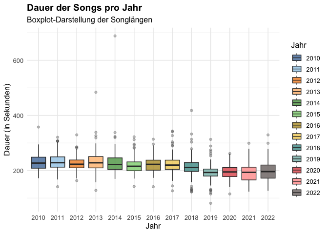

Spotify Datenanalysekurs
================
Nick Ruth
3/12/2021

### Einführung in die Spotify-Datenalyse für Musik- und Medienstudierende

In diesem Projekt sollen Studierende erste Erfahrungen mit der
Beschaffung von Daten über die Enticklerschnittstelle von Spotify zu
beziehen, diese wiederum analysieren üben und schließlich eine
Vorstellung von einem stark vereinfachten Empfehlungsalgorithmus zu
bekommen.

#### Erste Schritte

Zunächste werden erste Übungen mit der freien Softwareumgebung und
Programmiersprache *R* gemacht.

``` r
fuenf <- 5 
print(fuenf)
```

    ## [1] 5

``` r
fuenf * 4
```

    ## [1] 20

#### Visuelle Datenanalyse

Anschließend werden einige einfache Analysen mit einem Datensatz von
Spotify durchgeführt. Dabei werden die [Audio
Features](https://developer.spotify.com/documentation/web-api/reference/#object-audiofeaturesobject)
von Songs aus den
[Jahrescharts](https://www.billboard.com/charts/year-end/) von 2010 bis
2020 genauer betrachtet.

``` r
library(ggplot2)
spotify_data <- read.csv("./data/charts.csv")

beispiel_dauer_pro_jahr <- ggplot(data = spotify_data,
                                  aes(x = as.factor(year), 
                                      y = duration_ms/1000))

beispiel_dauer_pro_jahr + 
  geom_boxplot(aes(fill = factor(year))) +
  ggtitle("Dauer der Songs pro Jahr") +
  scale_fill_brewer(palette = "Spectral",
                    name = "Jahre") +
  xlab("Jahre") +
  ylab("Dauer in Sekunden")
```

<!-- -->

#### Eigener Empfehlungsalgorithmus

Um ein Verständnis dafür zu bekommen, wie Empfehlungen bei Spotify
funktionieren könnten, sollen zunächst eigene Regeln definiert werden,
um schließlich eine Funktion zu schreiben, die eine Empfehlung basierend
auf den gewählten Regeln ausgibt.

``` r
mein_tempo_minimum <- 120 

mein_genre <- as.character("dance pop")

mein_dance <- 0.65

mein_db <- -7

mein_value <- 0.50

algoRuthmus <- function(songtitel) {
  auswahl <- spotify_data[spotify_data$title == songtitel, ]
  punkte <-  0
  if(auswahl$tempo >= mein_tempo_minimum) {punkte <- punkte + 1}
  if(auswahl$genre1 == mein_genre) {punkte <- punkte + 1}
  if(auswahl$danceability >= mein_dance) {punkte <- punkte + 1}
  if(auswahl$loudness >= mein_db) {punkte <- punkte + 1}
  if(auswahl$valence >= mein_value) {punkte <- punkte +1}
  ergebnis <- (punkte/5) * 100
  sprintf("Dieser Song entspricht zu %s Prozent deinem Geschmack.", ergebnis)
}
algoRuthmus("Pumped Up Kicks")
```

    ## [1] "Dieser Song entspricht zu 100 Prozent deinem Geschmack."

#### Datensammlung

Als Bonus für Fortgeschrittene gibt es noch ein Script, in dem die
Datensammlung geschildert wird. Hier wird zunächst Webscraping mittels
der **rvest** betrieben, um die Chartlisten zu beziehen. Anschließend
wird das **SpotifyR** package genutzt, um mit der Spotify API zu
kommunizieren.
